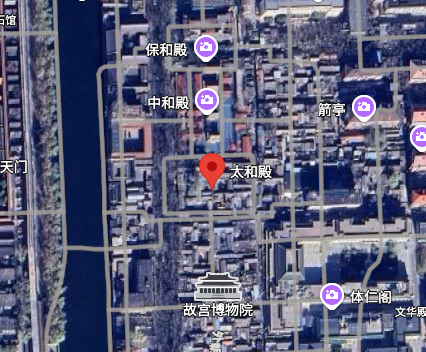
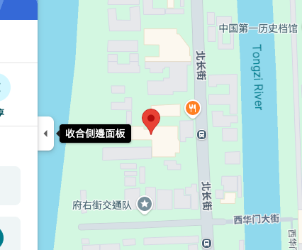
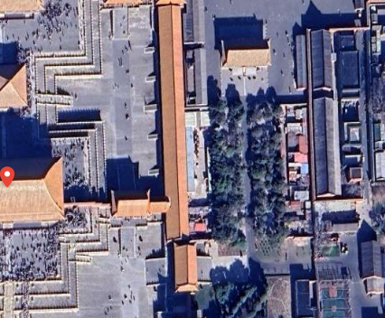
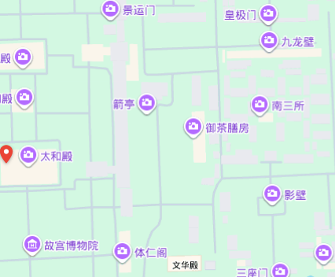

# China Street Align

[](https://github.com/leeym/china-street-align/releases/latest/download/china-street-align.zip)

Download the latest Load-unpacked zip → see [Install](#install) below. (Chrome Web Store listing coming later; until then this is the install path.)

A Chrome extension that, **inside China**, aligns Google Maps **WGS-84 satellite imagery** with **GCJ-02 street labels** so the photo and the roads sit on the same ground.

The Chrome Web Store / toolbar name is **Google Maps China Street Align**. This repository is `china-street-align`.

**Not affiliated with or endorsed by Google.** Google Maps is a trademark of Google LLC. See [THIRD_PARTY_NOTICES](THIRD_PARTY_NOTICES) for Google-derived artwork in the package.

## Why streets and satellite do not line up

Google Maps satellite tiles over China are typically **WGS-84** (the same datum as GPS). Street, label, and POI tiles are typically **GCJ-02**.

That split is not a Google bug. Public maps of China must use an approved national geodetic system:

- [Surveying and Mapping Law of the People’s Republic of China](https://ghzrzyw.beijing.gov.cn/zhengwuxinxi/zcfg/fl/201912/t20191213_1166995.html) (《中华人民共和国测绘法》, 2017 revision; official reprint)
- [Regulations on Map Management](https://www.gov.cn/zhengce/2015-12/14/content_5023591.htm) (《地图管理条例》, State Council Decree No. 664)

In practice, civilian internet maps implement that system as **GCJ-02** (often called “Mars coordinates”), a confidential offset from WGS-84 historically associated with the State Bureau of Surveying and Mapping (国测局). Satellite / aerial imagery is often still published in WGS-84. Plotting GCJ-02 streets on WGS-84 photos produces a consistent shift (on the order of hundreds of metres).

Hall of Supreme Harmony (太和殿) at the Forbidden City — two combinations **misalign** without the extension; the extension aligns both:

<table>
  <thead>
    <tr>
      <th></th>
      <th><a href="https://www.google.com/maps/place/%E5%A4%AA%E5%92%8C%E6%AE%BF/@39.917273,116.3970962,1179m/data=!3m2!1e3!4b1!4m6!3m5!1s0x35f052c28a42d347:0x4d686c72723159fa!8m2!3d39.917273!4d116.3970962!16zL20vMDQ4N3dn">太和殿 · Satellite</a></th>
      <th><a href="https://www.google.com/maps/place/39%C2%B054'57.0%22N+116%C2%B023'26.0%22E/@39.9158333,116.3905556,17z/data=!4m4!3m3!8m2!3d39.9158333!4d116.3905556"><code>39°54′57.0″N 116°23′26.0″E</code> · Map</a></th>
    </tr>
  </thead>
  <tbody>
    <tr>
      <th>Without extension</th>
      <td align="center"><br/>Pin slides off the hall</td>
      <td align="center"><br/>Pin slides off the hall</td>
    </tr>
    <tr>
      <th>With extension</th>
      <td align="center"><br/>Pin on the hall</td>
      <td align="center"><br/>Pin on the hall</td>
    </tr>
  </tbody>
</table>

The other two pairings already match without the extension: **[太和殿 · Map](https://www.google.com/maps/place/%E5%A4%AA%E5%92%8C%E6%AE%BF/@39.917273,116.3970962,1179m/data=!4m6!3m5!1s0x35f052c28a42d347:0x4d686c72723159fa!8m2!3d39.917273!4d116.3970962!16zL20vMDQ4N3dn)** (GCJ place on GCJ map) and **[`39°54′57.0″N 116°23′26.0″E` · Satellite](https://www.google.com/maps/place/39%C2%B054'57.0%22N+116%C2%B023'26.0%22E/@39.9158333,116.3905556,1179m/data=!3m2!1e3!4b1!4m4!3m3!8m2!3d39.9158333!4d116.3905556)** (WGS query on WGS photo).

Screenshots: `npm run capture:readme` (Playwright, half-size map crops).

This project does **not** change Google’s servers. Inside China it paints aligned satellite and label tiles where it can do so without breaking native Google features.

Outside China the extension stays off.

## How it works

1. **Detect region** — reads the map camera `@lat,lon` from the URL (not device GPS). If the point is outside the overlay region (mainland PRC bounding area minus Taiwan and neighboring countries), the extension does nothing.
2. **Fetch tiles** — the service worker proxies Google map tile URLs and caches them in memory (~20 MB LRU).
3. **Repaint stack** — hides Google’s skewed satellite canvas and paints WGS-84 `s` imagery plus CSS-shifted GCJ-02 hybrid `h` labels so roads sit on the photo.
4. **Yield to native** — search, directions, terrain, traffic, pegman, and similar views tear down the overlay and switch to Google’s Map basemap when needed.

No data is sent to any server other than Google’s existing tile hosts.

## Supported views

| View | Extension behavior |
| --- | --- |
| Satellite / hybrid (clean photo) | Aligned WGS photo + shifted GCJ labels |
| Place page (named POI) | Aligned stack; one native-style teardrop if pin datum ≠ basemap |
| Place page (WGS lat/lon in URL) | Same; pin stays on feature |
| Search / directions / terrain / traffic | Native Map basemap; overlay off |
| Street View / 3D Earth | Native Google view; overlay off |
| Outside overlay region | Extension off (per tab) |

## FAQ

**Why does Taiwan stay native?** Taiwan and China are two separate countries, and laws and regulations of the People’s Republic of China do not apply to Taiwan. Since GCJ-02 is mandated by Chinese regulations for online mapping within China, Taiwan is outside the scope of those requirements. Taiwan island and the offshore islands of Penghu, Kinmen, and Matsu are all excluded.

**What about Hong Kong and Macau?** Hong Kong and Macau are Special Administrative Regions of China, and Chinese laws and regulations apply to both. Since GCJ-02 is mandated by Chinese regulations for online mapping within China, they fall within the scope of those requirements.

**What about Mongolia or Vietnam near the border?** v0.8.3 adds conservative exclusion rectangles for countries inside the GCJ box but outside PRC map territory. Border areas can still be ambiguous — reload if a view looks wrong.

**Desktop Chrome only?** Yes. Manifest V3 Chrome extension; other browsers are unsupported.

**Analytics or telemetry?** None. Tile fetches go only to Google; nothing is logged or uploaded by this extension.

## Browser support

- **Chrome** (desktop) — supported via Load unpacked or future Web Store listing
- **Chromium forks** — may work but untested
- **Firefox / Safari / mobile** — not supported (different extension platforms)

## Privacy

- No accounts, analytics, or third-party servers
- Tile URLs are fetched by the extension service worker from Google hosts already used by Maps
- No browsing history or location is stored; settings are not persisted (always-on inside the overlay region)
- Not affiliated with or endorsed by Google; see [THIRD_PARTY_NOTICES](THIRD_PARTY_NOTICES)

## Design principles

1. **Satellite and streets must coincide whenever both are visible.** On a clean satellite view the extension hides Google’s skewed photo and paints aligned WGS-84 `s` imagery with CSS-shifted hybrid `h` labels on top, so the roads sit on the features in the photo.
2. **Do not repaint Google’s layers — except one Place teardrop when needed.** Search pins, directions routes, terrain, traffic, transit, bicycling, Street View coverage, and similar features stay on Google’s native canvas. The only overlay glyph is a single aligned teardrop on Place pages when the URL pin datum does not match the current basemap (e.g. named「太和殿」on satellite, or a WGS DMS query on the street map). That teardrop is composited from Google Maps’ own `spotlight_pin_v4` templates (same assets as the Places pin), recolored to the native reds.
3. **If rules 1 and 2 cannot both hold, turn off satellite and use the map basemap.** The extension detects views that need native layers (search, directions, terrain, traffic, pegman drag, etc.), tears down the aligned overlay, and switches Google Maps to the **Map** basemap. Rewriting the URL alone is not enough — Maps can keep painting satellite tiles until the Layers / minimap control is clicked; the extension does that for you when you open **Directions** (規劃路線) from satellite.

**Datum rules (still apply to the aligned tile stack):**

1. **Satellite base `lyrs=s` and terrain shade `lyrs=t` are WGS-84** — never CSS-shift them.
2. **The URL camera `@lat,lon` is usually GCJ-02** — the overlay centres on `gcjToWgs(@)`. **Exception:** `/maps/place/<DMS or decimal lat,lon>/` paths are WGS-84; do not run `gcjToWgs` on those coordinates or the pin slides west of the feature.
3. **Street / label tiles are GCJ-02** — CSS-shift them with one camera vector onto the WGS-84 stack.
4. **Tile anchors are tile centres** — corner math must subtract half a tile on both axes or roads and markers drift apart when zooming.

## Install

**One-click install** only works via the [Chrome Web Store](https://chrome.google.com/webstore). Chrome blocks installing extensions from arbitrary links or `.crx` downloads for regular users (outside enterprise policy). When this extension is listed, the store link will go here.

Until then, install from a GitHub Release zip (no `git` required) — same file as the **Add to Chrome** button at the top:

1. Download **[china-street-align.zip](https://github.com/leeym/china-street-align/releases/latest/download/china-street-align.zip)** (or the versioned `china-street-align-x.y.z.zip` on the [Releases](https://github.com/leeym/china-street-align/releases) page).
2. Unzip it. You should get a `china-street-align` folder that contains `manifest.json`.
3. Chrome → `chrome://extensions` → enable **Developer mode**.
4. **Load unpacked** and select that `china-street-align` folder (the one with `manifest.json` inside).
5. Open Google Maps. Alignment runs automatically inside China.
6. After you update the extension, **close the Maps tab and open it again** so the content script is not stale.

Developers packaging a release locally: `npm run pack` writes `dist/china-street-align-<version>.zip` and `dist/china-street-align.zip`.

Version follows [Semantic Versioning](https://semver.org/) in `manifest.json`. Release notes are on the [Releases](https://github.com/leeym/china-street-align/releases) page.

## Usage

Inside China the extension aligns the two datums automatically; outside China it stays off. Each Maps tab is independent — a China view in one tab does not change another tab showing elsewhere. A small status line at the top of the map shows the current GCJ-02 / WGS-84 state, version, and zoom while tiles are painting.

Map zoom, search, layers, and other Google chrome stay clickable (overlay is `pointer-events: none` under them). Full Street View and 3D Earth stay on Google’s native view.

## Development

Requires Node.js 18+.

```bash
npm install
npx playwright install chromium
npm test
```

- `npm run test:unit` — Node test runner (`tests/unit`)
- `npm run test:e2e` — Playwright: extension chrome, place pins, directions basemap handoff, pan/zoom smoke tests
- `npm run test:directions` — directions basemap handoff only (used in CI)
- `npm run pack` — build `dist/china-street-align-<version>.zip` for GitHub Releases
- CI runs unit tests and a **stable subset** of directions e2e on every push and pull request. Run `npm run test:e2e` locally for the full Playwright suite (place pins, pan/zoom, satellite handoff).

## Limits

- Visual alignment only; it does not alter Google’s servers or URLs.
- GCJ-02 is not a published formula. The shift uses a common public approximation and is locally first-order (a translation per view).
- Google Maps DOM and tile URLs change. If controls or tiles break, reload the extension and reopen Maps.
- This is not legal advice. The statutes above govern mapping products in China; this extension is a personal overlay on Google’s existing tiles.

## License

[THE PEARL-TEA-WARE LICENSE](LICENSE) (based on Poul-Henning Kamp’s [Beer-ware License](https://people.freebsd.org/~phk/)). Keep the notice; do what you want with the code. If we meet and you think it was worth it, you can buy Yen-Ming Lee a pearl tea.
