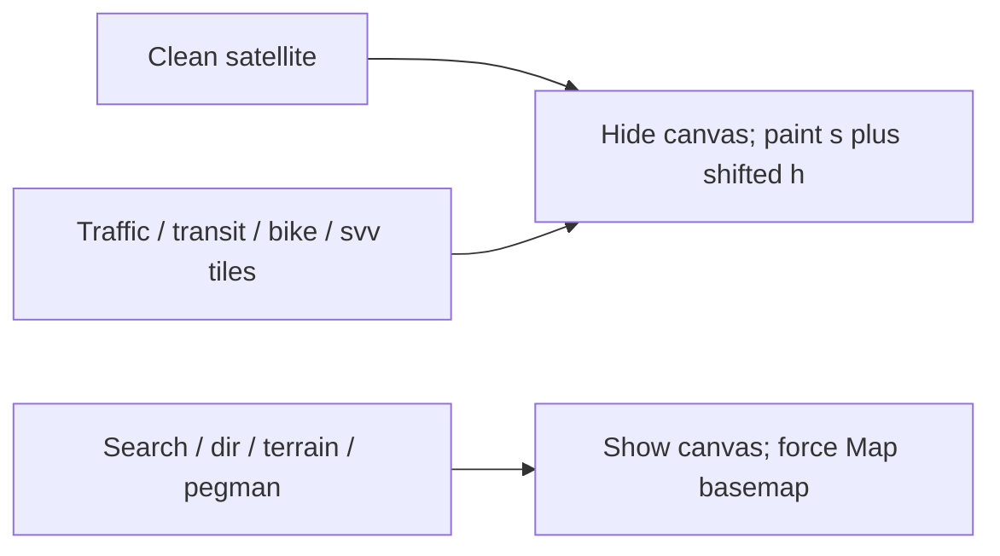

# Layers + aligned satellite — feasibility

Research note for keeping Google Maps **map layers** visible while the extension
keeps an **aligned satellite** stack (WGS `lyrs=s` + CSS-shifted GCJ `h`).

## Product decision (final)

| Feature | Layer type | Behavior |
| --- | --- | --- |
| Traffic / transit / bike | Own raster tiles (`h,traffic`, …) | Stay on **aligned satellite** via `extraLyrs` |
| Street View coverage (`!1e5` URL) | Own `svv` / `vt/pb` tiles | Stay on **aligned satellite** |
| Search pins, directions, terrain | Native canvas (same surface as basemap) | **Force Map** basemap; overlay off |
| Pegman drag / full Street View / 3D Earth | Native canvas / native view | **Force Map** or native Google view |

Abandoned: keeping aligned satellite while search / directions / terrain stay open
(those glyphs die when `hideNative` covers the canvas; no clean selective hide).

## Why canvas features cannot stay on satellite

Aligned satellite hides Google’s native map canvas. Search pins, route lines, and
terrain shading are composited on that canvas with the basemap — not separate
tile families the extension can leave visible. Hiding the skewed photo therefore
hides those features too.

Raster extras are different: Maps exposes independent `lyrs=` families, so the
extension can paint them on the aligned `s`+`h` stack with the same GCJ CSS shift.

## Options considered

| Option | Idea | Verdict |
| --- | --- | --- |
| **A. Raster extras on aligned stack** | Paint `h,traffic` / transit / bike / `svv` on `s`+`h` | **Shipped path** |
| **B. Terrain shade stack** | Unshifted WGS `t` + shifted `m`/`h` | Deferred; yield to Map |
| **C. Redraw directions** | Custom polylines | Deferred; yield to Map |
| **D. Search / multi-POI** | Repaint WebGL pins | Deferred; yield to Map |
| **E. True blend** | Native overlays over forced transparent basemap | Out of scope |

